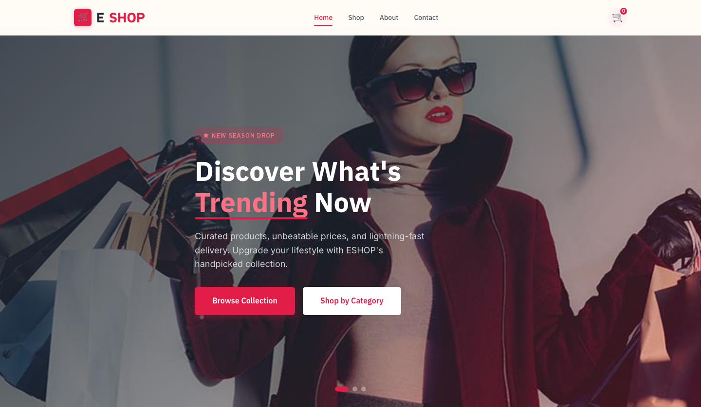

# E-Commerce Shop HTML Template — ESHOP

A premium, framework-free e-commerce storefront built with semantic HTML, CSS custom properties, and vanilla JavaScript. Designed for product discovery, featuring a curated catalog with category filtering, hover-interactive product cards with a distinctive price-tag badge motif, and a working cart demo.

**Design Concept:** ESHOP treats the price tag as its visual signature — angled clip-path badges pulse on sale items, product cards reveal quick-action buttons on hover with a spring-eased lift, and the warm-white/rose palette keeps the shopping experience feeling fresh and inviting rather than sterile.

---

## 📸 Screenshot



## Pages

| Page | File | Description |
|------|------|-------------|
| Home | [`index.html`](index.html) | Hero slider with 3 rotating backgrounds, category grid, 9 featured products with filters, brands strip, feature highlights, newsletter |
| Shop | [`products.html`](products.html) | Full 9-product catalog with category tab filters, sort dropdown, and interactive cart add |
| About | [`about.html`](about.html) | Brand story, animated stat counters, values grid, department showcase |
| Contact | [`contact.html`](contact.html) | Contact info cards, validated form with `[data-form]` / `.form-ok` / `.form-err`, support features |

---

## Design Distinction (6-Axis)

| Axis | ESHOP Approach |
|------|---------------|
| **Hero Composition** | Full-bleed image slider with dark gradient overlay + angled rose accent bar, not a centered text hero |
| **Visual Metaphor** | Price-tag badge motif (clip-path angled corners) on every sale/hot/new tag — the product's pricing identity is its design identity |
| **Color Logic** | Warm white (#FFFBF5) base with rose (#E11D48) as the single action color — not a blue/gray SaaS palette or dark luxury cliché |
| **Typography Personality** | IBM Plex Sans (geometric, structured) for headings; Inter for body — the contrast between engineered headings and friendly body text mirrors the shopping journey: browse with confidence, decide with ease |
| **Motion Signature** | `salePulse` keyframe on discount badges (ring-expand glow), spring-eased card lift (`ease-spring` cubic-bezier), IntersectionObserver scroll reveals with staggered delays |
| **Section Inventory** | Hero slider, category cards, 3-tab product grid, brand grayscale strip, feature icons bar, newsletter — unique combination not shared by sibling templates |

---

## Features

- **Product Grid:** 9 cards across 3 categories (Fashion, Electronics, Accessories) with tab-based filtering and animated transitions
- **Price Tag Badges:** Clip-path angled tags with `salePulse` animation on sale items — the template's signature motif
- **Hover Interactions:** Product cards lift with shadow bloom; quick-add and wishlist buttons slide in from below
- **Cart Demo:** Click any cart button to increment `[data-cart-count]` with a spring-bump animation and toast notification
- **Hero Slider:** 3-image auto-rotating slider with dot navigation, pause-on-hover
- **Scroll Reveals:** `IntersectionObserver` with `threshold: 0.12` for staggered entrance animations
- **Active Navigation:** Current page highlighted in nav, burger menu for mobile
- **Contact Form:** Client-side validation with `data-form` attribute, `.form-ok` / `.form-err` message states
- **Stats Counter:** Animated number counting on the About page using `IntersectionObserver`
- **Responsive:** 980px breakpoint (2-col grid), 720px breakpoint (1-col + burger menu)
- **Accessibility:** Semantic HTML, ARIA labels, `role` attributes, `prefers-reduced-motion` support
- **Performance:** Zero dependencies, lazy-loaded images, requestAnimationFrame throttling on scroll

---

## File Structure

```
e-commerce-shop-html-template/
  assets/
    css/
      base.css          # Design system, tokens, all component styles
    js/
      main.js           # Vanilla JS — nav, slider, filters, cart, form, scroll
    img/
      product-1..9.png  # Product photography
      slider-1..3.jpg   # Hero slider backgrounds
      category-1..4.jpg # Category card images
      brand-1..6.png    # Brand logos
      logo.png          # Brand logo
      payment-method.png
      *.svg             # Trust badges
  index.html            # Homepage
  products.html         # Shop / catalog
  about.html            # Brand story
  contact.html          # Contact form + info
  README.md             # This file
```

---

## Tech Stack

- **HTML5** — semantic markup, accessibility attributes
- **CSS3** — custom properties, Grid, Flexbox, `clamp()`, `clip-path`, keyframe animations
- **Vanilla JavaScript** — IntersectionObserver, event delegation, no dependencies
- **Google Fonts** — IBM Plex Sans + Inter

## Getting Started

1. Open `index.html` in any modern browser
2. All assets are relative — no build step required
3. Edit `assets/css/base.css` to customize the design token values (`:root` block)
4. Replace images in `assets/img/` with your own product photography

## Customization

All design tokens live in the `:root` block of `base.css`:

```css
:root {
  --clr-rose: #E11D48;      /* Primary accent */
  --clr-charcoal: #1F2937;   /* Dark text/bg */
  --clr-warm-white: #FFFBF5; /* Page background */
  --clr-soft-pink: #FFF1F2;  /* Alternating sections */
  --ff-heading: 'IBM Plex Sans', sans-serif;
  --ff-body: 'Inter', sans-serif;
}
```

---

Let's Build Something Together 🚀
https://tally.so/r/q4q1L9
